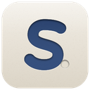
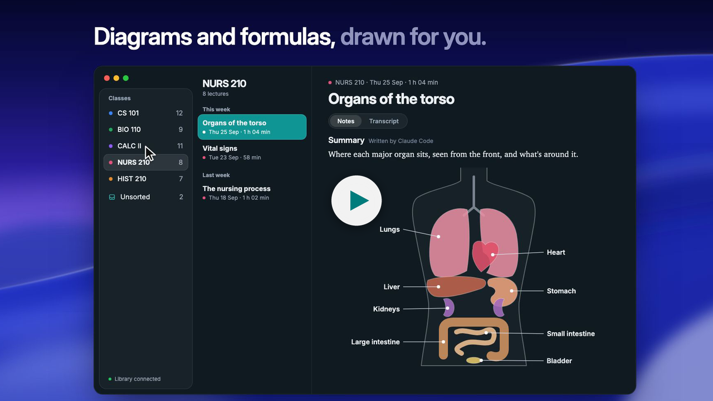
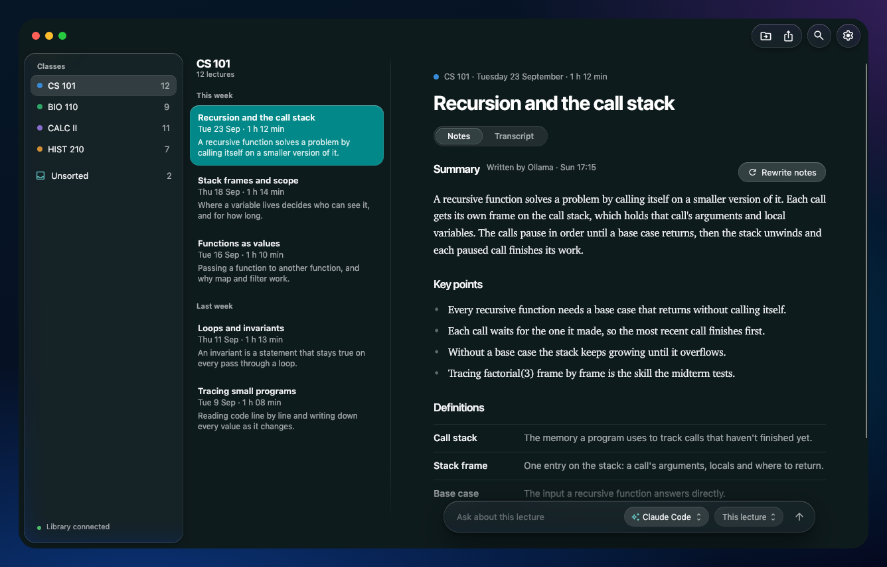
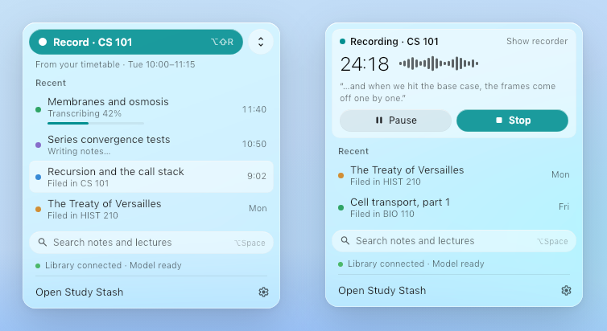
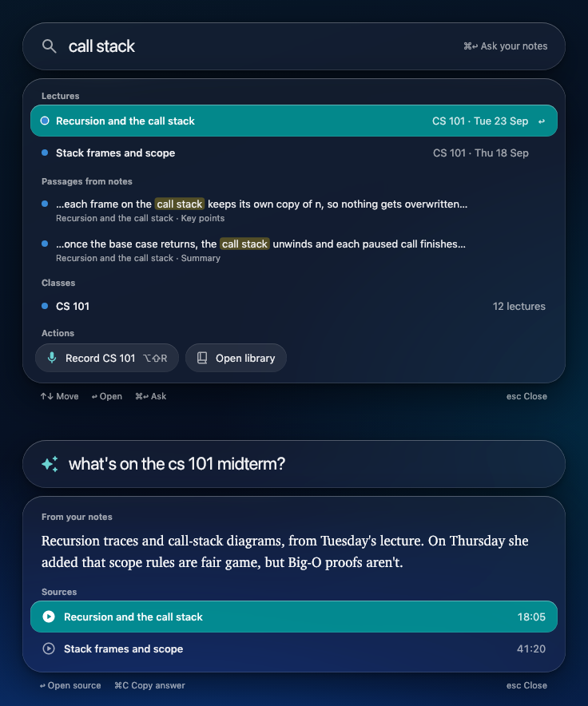
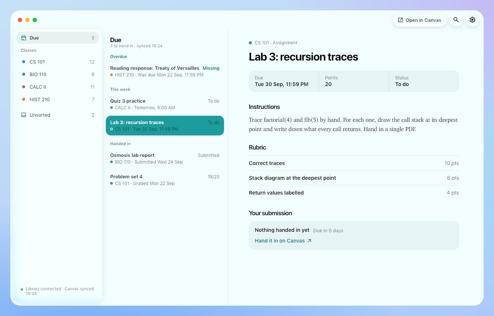

<p align="center"></p>

# Study Stash

Your own lecture library. Record a lecture, and it's transcribed on your computer, filed under the
right class, and turned into study notes — next to your Canvas assignments, and ready to ask about.
Free and open source, for Mac and Windows, and your recordings never leave your own computers.

[](https://study-stash-app.web.app/assets/study-stash-demo.mp4)

[Watch the 50-second demo](https://study-stash-app.web.app/assets/study-stash-demo.mp4) (it's narrated, so turn the sound on).

## What it does

- **Records and transcribes on your computer.** Click **Record** in the menu bar (Mac) or tray
  (Windows), or press ⌥⇧R / Ctrl+Alt+R. It transcribes as you go, so the recorder shows what's
  said and you can ask about it mid-lecture; or, to save battery, it only records during the lecture
  and transcribes it after class (Settings → Recording). The audio never leaves your computer. A Mac with Apple silicon or a PC with a graphics card uses Whisper (Metal or Vulkan),
  starting on the compact large-v3 turbo, which keeps up and leaves room for everything else. A
  computer with no graphics card Whisper can use, and 4 fast cores and 8 GB of memory, starts on
  NVIDIA's Parakeet instead (a 2.5 GB download): it's made for the processor, nearly as accurate as
  the compact turbo, and never makes up words over silence; it reads 25 European languages, and a
  lecture in another language uses Whisper. A computer too weak for either gets a lighter Whisper.
  The bigger, more accurate models are a choice in setup and Settings → Recording, and so, on a Mac
  with Apple silicon or a PC with an ARM processor, is Cactus Whistle, the fastest and smallest, which
  comes with the app (about as accurate as Whisper base).
  Whatever the model, while a lecture is transcribed as you go, the open recorder shows what's said
  a second or two after it's said: a quick model hears the newest sound every second, and the chosen
  model's more accurate lines take its place as they come (about half a minute behind). The quick
  model comes with the app: Cactus Whistle on Apple silicon and Windows on ARM, where its engine is
  fastest; a small Whisper (tiny, 44 MB) on Intel Macs and other PCs, where Whistle's engine is
  slow. Every pass is timed, and each lecture's first is a short test: where this computer can't
  keep up cheaply during a lecture (a pass taking more than 0.3× the sound it hears), the live words
  switch themselves off for that lecture and the recorder shows the chosen model's lines only; the
  next lecture tries again. Whistle reads English, German, French, Spanish, Italian, Dutch and
  Polish; on a computer that hears the live words with it, a lecture in another language shows the
  chosen model's lines only. In Settings → Recording, an
  experimental **Tell speakers apart** also marks in a transcript ("Speaker 2:") where a voice other
  than the lecturer's seems to speak; it is careful rather than complete, and can be wrong. While it
  records, a tiny pill shows the time and the level; pause or stop from the menu bar.
- **Writes study notes with the AI you choose.** A summary, key points, definitions and questions
  to review, written by Ollama (free and private) or by Claude Code, Codex or Gemini with the plan
  you already have. Rewrite a lecture's notes with another engine and keep whichever you like.
- **Files every lecture under its class**, working out which from what was said, or using the class
  you picked. Anything it can't place waits in **Unsorted**, and a lecture you don't need can be
  deleted (with Undo).
- **Shows you everything at a glance.** The library opens on **Home**: what's due soon, what's
  coming up, your newest lectures and a card for every class. Each class (or club) has a home of
  its own too: its lectures, what's to hand in, when it next meets, its files, and on Canvas its
  assignments, modules and announcements.
- **Ask about any lecture, class, or all of them.** The Ask bar under a lecture's notes answers
  from your notes and transcripts, with the engine you pick for that question.
- **Finds anything in a second.** The quick panel (⌥Space on a Mac, Alt+Shift+Space on Windows)
  searches lectures, passages in your notes, and classes, and asks your notes a question.
- **Knows what's coming up.** Paste your calendar's link (Google's secret iCal address, iCloud,
  Outlook or your school's) in Settings → Calendars and pick which calendars to share. Upcoming
  classes show in the menu bar, the quick panel and the library, and a lecture recorded during one
  is named after it and filed under its class.
- **Takes your own notes and slides too.** Attach iPad handwriting, slides, PDFs or photos to a
  lecture or class (drag them in). Their words, handwriting included, are read on your computer
  and go into the lecture's notes, Ask and Claude.
- **Brings in Canvas.** What's due across your classes, each assignment's instructions, rubric,
  your submission and feedback, module files and pages, announcements, quizzes and discussions.
- **Comes with you on your phone.** Your library serves a phone app over Tailscale: read your
  notes, see what's coming up, search, and add photos and PDFs to a lecture from your iPhone or
  iPad. Settings → Your library → Phone shows a code to pair it ([docs/phone.md](docs/phone.md)).
- **Lets AI apps read your library** over MCP: Claude Desktop, Claude Code, Codex and Gemini CLI on
  your computer with one click (no Tailscale needed), and claude.ai through a Tailscale Funnel.
- **Looks at home on your computer.** A native Mac look (Liquid Glass) and Windows 11's, light and
  dark, with ten colour themes in Settings → Appearance.
- **Keeps itself up to date**, quietly, when nothing is recording.



<p align="center">
  
  
</p>



## One computer or two

Study Stash is one app with two jobs, so you can use it the way that suits you:

- **One computer.** Your laptop records, keeps the library and writes the notes itself. Nothing
  else to set up. Notes are written while it's on.
- **A laptop and a library.** Your laptop records; a computer that stays on at home (a Mac mini,
  an old laptop, any Mac or PC) keeps the library, writes the notes and syncs Canvas, even while
  your laptop is asleep. The laptop reaches it at home or, anywhere, over
  [Tailscale](https://tailscale.com).

```
your laptop                                  your library (this laptop, or a computer at home)
┌────────────────────────────┐   lectures   ┌──────────────────────────────────────────────┐
│ record → Whisper (local)   │ ───────────▶ │ study notes (your AI) → filed under its class │
│ ask, search, Canvas, notes │ ◀─────────── │ Canvas mirror · Claude/MCP · search           │
└────────────────────────────┘              └──────────────────────────────────────────────┘
```

## Install

One download for every computer, on the [latest release](https://github.com/Joseph-Rus/study-stash/releases/latest):

| Mac | Windows |
|---|---|
| [Study-Stash.dmg](https://github.com/Joseph-Rus/study-stash/releases/latest/download/Study-Stash.dmg) | [Study-Stash-Setup.exe](https://github.com/Joseph-Rus/study-stash/releases/latest/download/Study-Stash-Setup.exe) |

It's the same app either way; what a computer is for is chosen when you first open it, not when
you download it. The Mac app needs macOS 15 (Sequoia) or later, on Apple silicon or Intel; the
Windows one, Windows 10 or 11.

- **Mac:** open the DMG and drag **Study Stash** into Applications. It's signed with a Developer ID
  and notarized by Apple, so it opens like any app from the internet (macOS asks once whether to
  open it). Allow the microphone when it asks.
- **Windows:** run the Setup.exe. It installs for your account only, no admin rights needed. If
  Windows says "Windows protected your PC", click **More info**, then **Run anyway**.

Then open **Study Stash**. See [Setting up](#setting-up).

## Setting up

The first time Study Stash opens, it asks which AI will set it up with you:

- **Claude** (through Claude Code, from Anthropic): needs a paid Claude plan, Pro or Max.
- **ChatGPT** (through Codex, from OpenAI): needs a paid ChatGPT plan, Plus or higher.

Pick one, press **Install** (Study Stash runs its maker's own installer, for your account only, no
admin password; nothing is downloaded until you press it, and it's skipped when it's already
there), then **Open sign-in page** to sign in on Claude's or ChatGPT's own page. Study Stash never
sees your password or your sign-in. A tiny test message then checks your plan includes it.

After that your AI walks you through the rest in a chat, with a checklist beside it: one computer or
two, the microphone, the transcription model, your classes, Canvas, and starting at login. It can
only use Study Stash's own setup tools (no commands, files or web), and anything that changes your
computer happens only when you press the button in its card. Close the window part-way and the chat
picks up where it left off. The chat uses a little of your plan, and your AI then writes your
notes and answers your questions (you can switch to a free local model in Settings any time).

**No subscription?** "Use a free model on this Mac (Ollama)" on the first screen goes to setup by
hand, with Ollama picked for your notes. **Set up by hand** is on every screen too, and
**Settings → General → Run setup** runs either again.

Setup by hand asks how you'll use it:

- **Just this computer:** check the microphone, download the transcription model, choose who
  writes the notes, Canvas, your classes, and starting at login (recommended, so your library runs
  whenever you're logged in).
- **This is my library:** a password for your library, who writes the notes, Canvas, your classes, and
  starting at login. It ends by showing the address and password to connect a laptop.
- **This is my laptop:** find your library (or type its address and password), check the microphone,
  download the transcription model, Canvas, and your classes.

Changed your mind, or your plans changed? Switch any time in **Settings → Connection → This
computer**: a laptop can also become your library (bringing over whatever it was connected to
before), and a library can become a laptop, sending its own lectures to the new one first so
nothing is left behind. Nothing to reinstall or redownload.

Or install from a terminal:

```bash
# Mac (Terminal)
curl -fsSL https://raw.githubusercontent.com/Joseph-Rus/study-stash/main/install.sh | sh
```
```powershell
# Windows (PowerShell)
irm https://raw.githubusercontent.com/Joseph-Rus/study-stash/main/install.ps1 | iex
```

## AI engines

Pick who writes your notes and who answers your questions in setup or in
**Settings → Your library → AI engines** — one engine for everything, or a different one for each
job. The same page switches the rich notes (below) and sets how fast Claude Code works. The engines run on your library's computer (with one computer, that's your laptop). Without an
engine, lectures are still filed and keep their transcripts. With Claude Code, Codex or Gemini, a
lecture's transcript (and, for its diagrams, its notes) goes to that AI under your own account;
with Ollama nothing leaves your computer.

**Ollama** — free, and nothing leaves your computer. Install it from [ollama.com](https://ollama.com),
and Study Stash offers to download a model.

**Claude Code** — uses your Claude plan. Install it, then run `claude` once in Terminal and sign in:

```bash
curl -fsSL https://claude.ai/install.sh | bash      # Mac (or: brew install --cask claude-code)
```
```powershell
irm https://claude.ai/install.ps1 | iex             # Windows (PowerShell)
```

**Codex** — uses your ChatGPT plan. Install it, then run `codex` once and choose **Sign in with
ChatGPT**:

```bash
npm install -g @openai/codex                        # Mac or Windows (or on a Mac: brew install --cask codex)
```

**Gemini** — the Gemini CLI, signed in with your Google account.

Setup's notes step shows these commands with a Copy button, opens Terminal for you, and has
**Check again** to pick the engine up once it's installed and signed in.

**Rich notes** are the diagrams, formula plots and drawings a lecture's notes get after they're written.
They're on, as they always were; **Settings → AI engines → Rich notes** switches them off (plain
notes only, and no second call to your AI at all) or one kind at a time: **Diagrams** (flowcharts, state
and sequence diagrams, timelines, mind maps), **Formula plots** and **Drawings** (labelled figures of
what a lecture describes). A kind that's switched off is never asked of the AI — its part of the
designer's brief isn't even sent — and one the designer draws anyway is left out. Switching off the last
kind switches rich notes off. **Drawn by** (below) is their pick of who designs them; the old *Off*
choice is the Rich notes switch now. Your notes never wait for it: a lecture is filed, readable
in the app, on your phone and in Ask, the moment its notes are written, and its diagrams arrive a
few minutes later, put into the notes where they go (an open lecture's byline says *Adding
diagrams…* meanwhile, then *Diagrams added*; the page stays where you're reading). Once a lecture's
notes are filed, a stronger model reads its timed transcript and the notes, decides whether the lecture teaches anything a picture makes
clearer (a process, a cycle, a pathway, a decision rule, a hierarchy, a structure, states and what
moves between them, an exchange between parties, a timeline, a topic's themes, a comparison, or
something spatial like the forces on an object), and if it does, designs it from what the lecturer
said and puts it at the end of the section it illustrates, with a title, a caption that says what
to notice, and the moment of the lecture it comes from. It picks the kind that fits: a flowchart
(a big topic as up to 36 boxes in groups, each box carrying the lecture's numbers and conditions in
smaller words), a state diagram (an automaton's accepting states double-circled), a sequence
diagram, a timeline or a mind map — or, when the lecturer gave a formula whose shape is the point (a
sigmoid, a loss curve, a distribution and its parameters, how running times grow, gradient descent
on a loss surface, what a matrix does to the plane), a plot of it. A lecture gets one per idea worth
drawing — up to four for a long one — one under about three minutes gets none, and so does a
lecture of discussion, admin or definitions.

A lecture that describes a physical thing at length — a drone's frame, motors and battery, the
bones and tendons of the hand, the heart cut open, a circuit board, a robot arm, a cell, a titration
set-up, a server rack — can also get an **illustration**: a detailed, labelled drawing of the thing
itself, like a figure in a textbook. The designer plans it (the view, where things go, and the parts
the lecturer named, each with a line from what was said). Then, most of the time, it's **composed
from ready-made parts** in seconds: Study Stash ships a library of about 300 professionally drawn,
openly licensed parts (Servier Medical Art's hearts, organs, organelles and glassware, DBCLS's bones,
public-domain cells, Wokwi's Arduino boards and modules, and Study Stash's own drone, robot-arm and
server-rack parts), finds the ones that fit the plan by its words, and a fast model (Claude Code's
Sonnet) answers with a small plan of which parts go where; Study Stash draws the parts, any simple
shapes nothing in the library shows (a tendon, a wire, a white tile) and the labels itself, in the
house style. The same plan again (a class that comes back to the drone) is drawn at once from the
last one. When the library has nothing for the subject, the same engine draws it shape by shape
instead, as before: soft flat colours by material, gentle shading, labels in columns with leader
lines, sent back once if it looks wrong. That takes 6 to 20 minutes with Claude Code's Opus, so the
diagrams of a lecture whose illustration is drawn can arrive up to 18 minutes after its notes (the
notes themselves are never held up). Either way its labels must be the lecture's words or it's left out, and only an engine that
draws well is asked (Claude Code, Codex, Gemini — never a local Ollama model). A lecture gets one,
two for a long one. Parts under a CC BY licence are credited under the figure.

- **Automatic** (the default) uses the strongest engine that already reads your lectures — the one
  that writes your notes or answers your questions — trying Claude Code (Opus, high effort), then
  Codex (high effort), then Gemini (3.1 Pro); otherwise the biggest model Ollama runs on the
  library's computer (never an Ollama cloud model). So a lecture never goes to an AI it wasn't
  already going to.
- **An engine of your own choice** uses its strongest model; one that isn't signed in or is over
  its limit falls back to Ollama when **Use Ollama instead** is on, as the notes do.
- **Same as notes** has the notes engine draw them as it writes, the way it did before 0.10.1
  (flowcharts, and drawings where its engine draws them; never plots).

**Claude Code speed** sets how fast Claude Code writes the notes and designs the rich notes (the
engine's other jobs, sorting and answers, never change). It's the same Claude Code run as before,
told one thing more, so a library's other engines aren't touched:

- **Standard**: as it's set up — the notes with the model you picked (or Claude Code's own default),
  the designer on Opus at high effort.
- **Fast mode**: Claude Code's own fast mode (`claude -p --settings '{"fastMode":true}'`, for that run
  only; it needs Claude Code 2.1.205 or later). It's the same Opus (5.5) with up to 2.5 times faster
  output, so the notes and the diagrams are as deep as ever, only sooner, but it's **billed at a higher
  rate** (Claude Code's own estimate came to about twice a standard run's) and, on a Pro, Max, Team or Enterprise plan, **only from your
  Claude account's usage credits**, which must be turned on (Settings → Usage on claude.ai) and are used
  even while your plan has usage left. A Claude account that can't use it (no usage credits, an
  organization that hasn't turned it on) just runs at its normal speed. A notes model you picked
  as Sonnet or Haiku stays as picked: fast mode is Opus's. The composer (Sonnet) never needs it.
- **Quicker model**: Sonnet at low effort for the notes and at medium for the designer. Quicker and lighter
  on your plan than Opus, with shallower notes and diagrams (a smaller model decides less well what's worth
  drawing).

On a 3,300-character test lecture on a Mac with Claude Code 2.1.289, the notes took 29.7 s
(3,475 tokens out) in standard speed and 12.3 s (3,757) in fast mode, and the designer 26.2 s (2,476) and
6.5 s (1,533): 56 s for both, down to 19 s. Claude Code estimated the cost at $0.33 and $0.66 for the
notes, and $0.21 and $0.37 for the designer.

A diagram that doesn't draw goes back once to be fixed and is otherwise left out, as is one with
too many boxes or words the lecture never said. Each one kept is laid out at the notes' width and
looked over; one that would look wrong (too wide to read, arrows crossing, a sentence in a box, a
big chart with no groups) goes back once with what's wrong, while there's time, and its redesign is
used only when it's better; a plot is worked out at its sliders' starting values and ends, and one
that's flat, undefined, off its axes or has a slider that changes nothing goes back the same way. If
the diagrams can't be designed (the engine is busy, over its limit,
or takes longer than 8 minutes, 18 with an illustration that has to be drawn), the notes stay exactly as filed. The library's log says
what was drawn and redesigned, or why nothing was.

The diagrams are designed one lecture at a time, never while notes are being written (a pass on the
library's own Ollama model steps aside for new notes and starts again after), and they survive a
restart: a pass cut off part-way runs again, three tries at most. They go in safely. If you (or an
AI in a chat) edit a lecture's note file while its diagrams are being designed, every edit is kept
and the diagrams go into its summary under their headings; a diagram whose heading has gone is left
out rather than put somewhere it doesn't belong; notes written again (**Rewrite notes with**, or
written afresh) get diagrams of their own instead, and a second pass replaces the first one's
diagrams rather than adding more. **Rewrite notes with** goes the same way: the new notes are ready
as soon as their words are, and their diagrams follow once you use them.

## Notes

A lecture's notes write formulas and diagrams as their own engine can, and the app draws them, in
the notes, in a quick answer and in the Ask chat:

- **Formulas** are LaTeX (`$...$` inline, `$$...$$` on their own line), typeset in the app's own
  type, light or dark. One CSharpMath can't typeset shows its plain source instead, calmly.
- **Diagrams**: a process, cycle, pathway or hierarchy comes back as a Mermaid flowchart
  (` ```mermaid `) and is drawn natively, in the theme's colours — a big one in groups, laid out as
  columns of its groups with square arrows between them; Mermaid state diagrams (automata too),
  sequence diagrams, timelines and mind maps are drawn natively as well; something spatial (a
  structure, a physics setup, a circuit) comes back as a sanitised SVG. They're designed after the notes by the
  engine that draws them (**Rich notes → Drawn by**, see [AI engines](#ai-engines)), each under a bold title with a
  caption and the moment of the lecture it comes from; rewriting a lecture's notes designs them
  again rather than adding more. Either kind opens larger on a click, and a diagram Study Stash
  can't draw shows its source with a plain reason instead of failing.
- **Illustrations**: a drawing of a thing the lecture described has parts you can point at. The
  pointer over a part lights it (and shows its name, even with the labels off) while the rest dims;
  a click pins it with its name, its line from the lecture, **Explain this**, **Quiz me**, **Where
  was this said?** and **Zoom in**. The labels turn off and on (L), **Tour the parts** walks them in
  the order their labels are read, and **Test yourself** hides every label: name each part to
  yourself and click it to check, with a small score. Search and Ask find an illustration by its
  parts and what it says of each; the phone lists them under it, and so does the Markdown download.
- **Studying from a diagram**: on screen a flowchart is there to explore, not just look at. The
  pointer over a box lights it, its arrows and the boxes they join while the rest dims; a click pins
  it, with **Explain this** and **Quiz me** (asked in the lecture's own Ask bar) and **Where was this
  said?**, which opens the transcript at the line that says it (Back to the notes returns to the
  diagram). Arrow keys walk along the arrows, ⌘ or Ctrl and the wheel (or a pinch) zoom and a drag
  pans. **Step through** walks it a box at a time in reading order (Play, or Space and the arrow
  keys), **Test yourself** hides its words to recall, a click checks one and a small score keeps
  count, with Hide some and Practise the missed ones, and a big chart made of groups opens as an
  overview, a group at a time. A designed diagram's **From 12:34 in the lecture** opens the
  transcript where it comes from. Opened larger, the window has all of this with a toolbar, and an
  SVG drawing zooms and pans there. Paper, the PDF and the Markdown download keep the still
  picture.
- **Plots**: a formula whose shape is the point is drawn as a ` ```plot `, exactly from the formula
  itself (the AI only writes the formula as the lecturer gave it, its ranges, sliders and labels;
  the app does the maths, so a curve is never drawn freehand): curves, parametric curves, bars for a
  distribution or a recurrence, shaded probabilities with their area, tangents with their slope,
  vectors and fields, a two-variable function as a heat map with contours and gradient descent
  across it, and a 2×2 matrix's map of the plane with its eigenvectors. Each parameter gets a slider
  (with a play button that sweeps it), the pointer reads every curve's value under a crosshair and a
  click pins it (with **Explain this**, **Quiz me** and **Where was this said?**), a point that's a
  slider can be dragged (a tangent along its curve), ⌘ or Ctrl and the wheel zoom (worked out again,
  so it stays exact), a click on the legend hides a curve, and **Predict** hides the curve for you to
  sketch first, then reveals it and says how close you came. A formula on its own line in the notes
  offers **Show what this looks like**, which asks the Ask bar for it as a plot. Paper and the PDF
  show it at its sliders' starting values; the Markdown download keeps its ` ```plot ` source with
  its picture saved beside it, and the phone shows the picture.
- **Download**: a lecture's "Download as Markdown…" (or a whole class's) saves a `.md` file that
  Obsidian, Typora and VS Code all open well — formulas stay LaTeX, a Mermaid diagram is saved
  again as an SVG beside it, and an SVG diagram becomes an image link to its own sanitised file.
  "Download as PDF…" saves the notes as the app draws them, ready to print: headings, tables, typeset
  formulas and diagrams as sharp vector drawings with the text selectable, light on white whatever
  the app's look, on Letter paper where that's the local size and A4 elsewhere, with page numbers.

## Canvas

Study Stash reads Canvas through Chrome with your own sign-in — no Canvas password or token — and
only reads; nothing on Canvas changes. On your library's computer:

1. **Settings → Your library → Canvas** (or the Canvas step in setup): type your school's Canvas
   address.
2. Click **Add to Chrome**. It opens Chrome's extensions page and shows the extension's folder.
   Turn on **Developer mode**, click **Load unpacked**, and pick that folder — or drag the folder
   onto the Extensions page. On a Mac the folder is **Study Stash → Chrome extension** in your home
   folder (`~/Study Stash/Chrome extension`), where Chrome's window can see it; on Windows it's
   `chrome-extension` in `%USERPROFILE%\.study-stash`.
3. Sign in to Canvas in Chrome, then click **Find my courses** and match each class to its course.

Canvas then syncs about once an hour while Chrome is open (it can stay minimized): what's due,
assignments with rubrics, your submissions and feedback, modules, files, pages and announcements,
filed into each class's folder.

## Claude, Codex, Gemini and MCP

Your library speaks [MCP](https://modelcontextprotocol.io), so AI apps can read your lectures, notes
and Canvas work (read-only). Set it up in **Settings → Your library → AI tool access**.

- **AI apps on this computer** (Claude Desktop, Claude Code, Codex, Gemini CLI): choose **Connect**
  next to the app. Study Stash adds itself to that app's own settings file, keeping everything else
  in it (and a copy of it as it was, `….study-stash-backup`), then shows you what it wrote. Quit and
  reopen the app (or start a new session) and the row turns to **Connected**. **Disconnect** takes
  only Study Stash back out. The app starts Study Stash itself and reads your library through this
  computer, so this works on a computer on its own: no Tailscale, no internet address, and no
  password goes into the app's settings. Another MCP app: **Copy setup** and paste it into its settings.
- **claude.ai in a browser, and the Claude phone app**: these run on Anthropic's servers, so they
  need an internet address. Turn on **Let Claude reach your library from the internet** (it uses a
  [Tailscale Funnel](https://tailscale.com/kb/1223/funnel), protected by signing in with your
  library password), then in Claude add a custom connector named **Study Stash** with the address
  `https://<your library's name>.<your tailnet>.ts.net/mcp`. On a computer without Tailscale the
  card says so, and links to Tailscale (free); nothing is put on the internet until you turn it on.

[docs/claude-connector.md](docs/claude-connector.md) has the details: each app's settings file,
what each can read, the web connector, troubleshooting, and how Claude's connector requirements are
met and tested.

## Updates

Installed copies update themselves: they check for a new release a few minutes after starting and
every 6 hours, and install it when nothing is recording or being transcribed. To update right
away, click **Update now** in **Settings → Your library → Library** (on a laptop that updates your
library). A laptop has its own **Check now**, **Update now** and **Update automatically** under
**Settings → General → Updates**, apart from the library's. On a Mac an update swaps in the
new **Study Stash.app**; on Windows it runs the new Setup.exe quietly. Every download is checked against the release's
`SHA256SUMS.txt` first.

## Uninstall

**Mac:** if you turned on **Open when you log in** (Settings → General), turn it off first, so no
login item is left behind; then quit Study Stash and drag it from Applications to the Trash.
**Windows:** Settings → Apps → **Study Stash** → Uninstall. Your lectures and settings stay where
they are; only the app goes. To remove them too, delete the folders under
[Where your data lives](#where-your-data-lives).


## Where your data lives

Your settings, the lecture database and the recordings are under `~/.study-stash` (or `--home`, or
the `STUDYSTASH_HOME` environment variable). The notes themselves are plain Markdown files in a
folder per class, by default in **Documents/Study Stash** on the library's computer (Settings → Your library →
Library → Notes folder shows where), which you can open, back up or sync however you like. On a Mac
the Chrome extension's folder is `~/Study Stash/Chrome extension`, because Chrome's Load unpacked
window doesn't show folders whose names start with a dot.

## Build from source

You need the [.NET 10 SDK](https://dotnet.microsoft.com), and [Node](https://nodejs.org) (22 or later) for the
phone app in `web/`.

```sh
dotnet build engine/StudyStash.slnx
dotnet test engine/StudyStash.slnx
dotnet run --project engine/src/StudyStash.App -- --home /some/temp/dir
(cd web && npm ci && npm test && npm run build)   # the phone app, into web/dist, which the app then carries
```

`macos/build-app.sh` builds "Study Stash.app" and `Study-Stash.dmg` (with Xcode's command line tools), and
`windows/build.ps1` `Study-Stash-Setup.exe`; both build the phone app into it first. `engine/README.md` has more on the projects and tests.

Releases come from CI (`.github/workflows/ci.yml`), at two speeds. A change that reaches `main` is
tested once: the engine's tests on macOS, Linux and Windows (side by side), and both apps built and
self-tested for real. No installer is kept, installed or published for it. A release is a push to `main` with a new
`StudyStashVersion` in `engine/Directory.Build.props` (no tag yet): CI also builds the installers,
proves them (the Mac app natively on an Intel Mac; Setup.exe installed, updated in place and
uninstalled), and publishes `Study-Stash.dmg`, `Study-Stash-Setup.exe` (and copies under the old
installers' names, so older copies still update) and `SHA256SUMS.txt`. A version already released is
never published again. Code that already passed isn't tested twice: a push that only changes the
version (or the docs) on top of a commit that passed, or a merge of a branch whose run passed on the
very same code, skips the tests, and a release then only builds and proves its installers. Branches
and pull requests aren't tested on their own: to prove one first (say, Windows-only code), start a
run by hand with **Actions → ci → Run workflow** or `gh workflow run ci --ref <branch>`. On a release
branch (a version with no tag yet) that run rehearses the whole release, installers included, down to
the checksums and short of publishing; merging that branch unchanged then publishes those very
installers, with no rebuild, within a minute. Add `-f installers=true` to rehearse it on any branch.

## Support Study Stash

Study Stash is free and open source, and two students build it with Claude. If it saves you time,
you can [buy us more Claude usage](https://ko-fi.com/studystashteam) on Ko-fi, and it goes into
building the next version.

## License

[MIT](LICENSE). No warranty: check your notes against the lecture before relying on them, since AI
makes mistakes. Record only where you're allowed to — many schools and places require everyone's
consent. See [SECURITY.md](SECURITY.md) to report a security problem.

Lectures are written down by [Whisper](https://github.com/openai/whisper) models (MIT, from OpenAI,
run with [Whisper.net](https://github.com/sandrohanea/whisper.net)) or, if you choose it, by
[NVIDIA Parakeet TDT 0.6B v3](https://huggingface.co/nvidia/parakeet-tdt-0.6b-v3)
([CC BY 4.0](https://creativecommons.org/licenses/by/4.0/)), converted to ONNX by the
[sherpa-onnx](https://github.com/k2-fsa/sherpa-onnx) project (Apache-2.0), which runs it. To tell
voices apart, when you turn that on, it uses
[pyannote's segmentation 3.0](https://huggingface.co/pyannote/segmentation-3.0) (MIT) and NVIDIA's
[TitaNet small](https://catalog.ngc.nvidia.com/orgs/nvidia/teams/nemo/models/titanet_small)
(CC BY 4.0), also converted by sherpa-onnx. The models are downloaded when you pick them, except the
live words' models, which come inside the app unchanged with their licences: on ARM,
[Cactus Whistle](https://huggingface.co/Cactus-Compute/whistle) and the
[needle](https://github.com/cactus-compute/needle) engine that runs it (both Apache-2.0, by Cactus
Compute; needle/LICENSE.txt beside the app); on x64, Whisper tiny (MIT, OpenAI; whisper.cpp's
ggml-tiny-q8_0 file; models/live-whisper-LICENSE.txt beside the app). Study Stash calls needle's
library directly: the anonymous usage counts that Cactus's Python package sends aren't part of it,
and nothing either model hears leaves the computer.

Illustrations are composed from parts drawn by [Servier Medical Art](https://smart.servier.com/)
(CC BY 3.0, via [Bioicons](https://bioicons.com)), the [DBCLS Togo Picture
Gallery](https://togotv.dbcls.jp/en/pics.html) (© 2016 DBCLS TogoTV / CC-BY-4.0), Bioicons' CC0
artists, Mariana Ruiz Villarreal (LadyofHats; public domain, via Wikimedia Commons) and
[Wokwi elements](https://github.com/wokwi/wokwi-elements) (© 2020 Uri Shaked, MIT), every part
recoloured to Study Stash's palette and simplified, and from Study Stash's own parts. Every part
and its licence is listed in [docs/parts-credits.md](docs/parts-credits.md); where they come from
and why, in [docs/parts-sources.md](docs/parts-sources.md).

Notes and diagrams are drawn with [CSharpMath](https://github.com/verybadcat/CSharpMath) (MIT,
bundling the [Latin Modern Math](https://www.gust.org.pl/projects/e-foundry/lm-math) font under
the GUST font licence), [Svg.Skia](https://github.com/wieslawsoltes/Svg.Skia) (MIT), and
[Microsoft Automatic Graph Layout](https://github.com/microsoft/automatic-graph-layout) (MIT).
